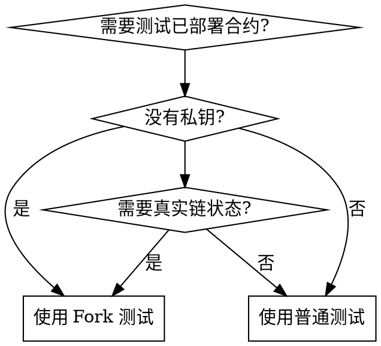

# Hardhat v3 Fork 单元测试规范

本规范适用于使用 Hardhat v3 + Foundry 风格在 Fork 主网环境下进行 Solidity 智能合约测试.

## When to Use



**使用场景:**
- 测试与已部署合约的交互
- 模拟任意地址 (无需私钥)
- 验证升级后的合约兼容性
- 在真实链状态上测试复杂交互

**不使用:**
- 简单的单元测试 (使用本地网络即可)
- 不依赖链状态的逻辑测试

## 测试文件命名规范

- `*Fork.t.sol` - Fork 主网已部署合约测试 (验证真实环境)

**注意**: Hardhat v3 Solidity 测试只识别 `.t.sol` 结尾的文件.

## 测试文件格式

### 文件头部注释

```solidity
/**
 * @title MyContract Fork 测试
 * @notice 在 BSC 主网 Fork 环境下测试已部署合约功能
 *
 * 运行命令:
 *   bunx hardhat test solidity contracts/MyContractForkTest.t.sol -vv
 *
 * 注意: Fork 在 setUp() 中使用 vm.createSelectFork() 实现
 */
```

### 测试合约结构

```solidity
// SPDX-License-Identifier: MIT
pragma solidity ^0.8.28;

import {Test, console} from "forge-std/Test.sol";

// 接口定义在合约外部
interface IERC20 {
    function name() external view returns (string memory);
    function symbol() external view returns (string memory);
    function decimals() external view returns (uint8);
}

contract ForkTest is Test {
    // 主网 USDT 地址
    address public constant USDT = 0x55d398326f99059fF775485246999027B3197955;

    // 合约接口
    IERC20 public usdt;

    function setUp() public {
        // 创建 BSC 主网 Fork
        vm.createSelectFork("https://bsc-dataseed.defibit.io");

        // 绑定主网合约接口
        usdt = IERC20(USDT);
    }

    /**
     * @notice [测试] 读取主网 USDT 基本信息
     */
    function test_ReadUSDTInfo() public view {
        string memory name = usdt.name();
        string memory symbol = usdt.symbol();
        uint8 decimals = usdt.decimals();

        console.log("USDT Name:", name);
        console.log("USDT Symbol:", symbol);
        console.log("USDT Decimals:", decimals);

        assertEq(symbol, "USDT");
    }
}
```

## 核心原则

1. **Fork 创建**: 在 `setUp()` 中使用 `vm.createSelectFork(rpcUrl)`
2. **合约地址**: 使用主网真实合约地址作为常量
3. **接口定义**: 在测试合约外部定义接口
4. **模拟账户**: 使用 `vm.deal()` 给主网地址充值 ETH/BNB
5. **完整模拟**: 使用 `vm.prank(sender, origin)` 完整模拟合约调用
6. **简洁**: 只保留核心功能, 不要写多余的验证和断言
7. **注释**: 使用中文注释说明测试目的
8. **console.log**: 使用中文输出关键信息

## 关键 Cheatcodes

| Cheatcode | 说明 |
|-----------|------|
| `vm.createSelectFork(url)` | 创建并切换到指定 RPC 的 Fork |
| `vm.deal(addr, amount)` | 给地址设置 ETH/BNB 余额 |
| `vm.prank(sender, origin)` | 完整模拟 (sender, origin) 调用 |
| `vm.roll(blockNumber)` | 设置区块高度 |
| `vm.warp(timestamp)` | 设置区块时间戳 |

## Fork 测试 vs 本地测试

| | Fork 测试 | 本地测试 |
|--|-----------|----------|
| **环境** | 主网真实状态 | 本地模拟状态 |
| **合约** | 使用已部署合约地址 | 部署新合约实例 |
| **速度** | 慢 (需要 RPC 请求) | 快 |
| **用途** | 验证真实环境行为 | 验证逻辑正确性 |
| **创建方式** | `vm.createSelectFork()` | 直接 new 合约 |

## 运行测试

```bash
# 运行所有测试
bunx hardhat test solidity

# 运行单个 Fork 测试文件
bunx hardhat test solidity contracts/MyContractForkTest.t.sol

# 运行指定测试函数
bunx hardhat test solidity contracts/MyContractForkTest.t.sol --grep "test_MyFunction"

# 显示详细输出
bunx hardhat test solidity contracts/TopAccountForkTest.t.sol -vv
```

## 注意事项

1. **Fork 不持久**: 每个测试函数执行后 Fork 状态重置
2. **RPC 稳定**: 确保 RPC 节点可用, 建议使用稳定的公共节点
3. **主网状态变化**: Fork 的是特定区块, 主网状态变化不影响已执行的测试
4. **无常方法**: 修改合约状态的测试在 Fork 中无效 (调用的是远程合约)

