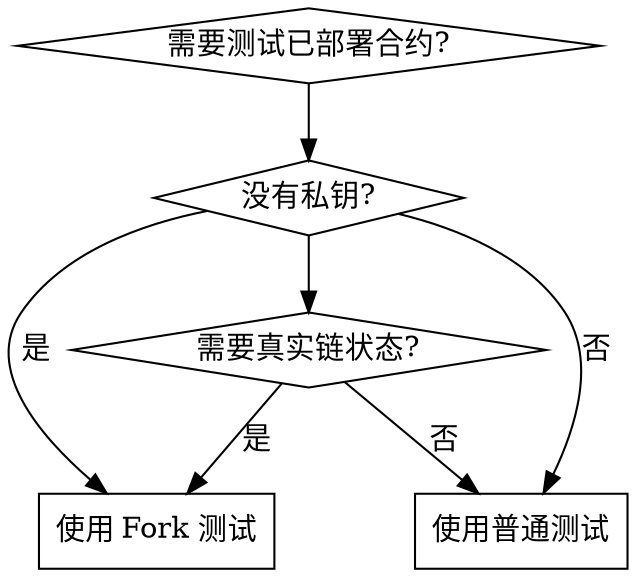

# Hardhat v2 Fork Testing

## Overview
使用 Hardhat v2 Network 的 fork 功能，在本地环境中模拟主网/测试网状态，无需私钥即可模拟任何地址进行测试。

**注意：Hardhat v3 语法不同，本技能仅适用于 Hardhat v2**

## When to Use



**使用场景：**
- 测试与已部署合约的交互
- 模拟任意地址（无需私钥）
- 验证升级后的合约兼容性
- 在真实链状态上测试复杂交互

**不使用：**
- 简单的单元测试（使用本地网络即可）
- 不依赖链状态的逻辑测试

## Core Pattern

**Before (直接连接真实网络):**
```typescript
// ❌ 不支持 impersonateAccount
const signers = await ethers.getSigners();
user = signers[0]; // 只能用配置的账户
```

**After (使用 fork):**
```typescript
// ✅ 可以模拟任何地址
await ethers.provider.send("hardhat_impersonateAccount", [TARGET_ADDRESS]);
user = await ethers.getSigner(TARGET_ADDRESS);
```

## Quick Reference

| 操作 | 命令/代码 |
|------|----------|
| **启动 fork 测试** | `FORK_ENABLED=true FORK_URL=<RPC_URL> bunx hardhat test --network hardhat` |
| **模拟账户** | `await ethers.provider.send("hardhat_impersonateAccount", [address])` |
| **设置账户余额** | `await ethers.provider.send("hardhat_setBalance", [address, balance])` |
| **推进时间** | `await ethers.provider.send("evm_increaseTime", [seconds])` |
| **挖出新块** | `await ethers.provider.send("evm_mine", [])` |

## Implementation

### 1. hardhat.config.ts 配置 (Hardhat v2)

```typescript
networks: {
  hardhat: {
    chainId: 1337,
    accounts: {
      mnemonic: "test test test test test test test test test test test junk",
      count: 400,
    },
    forking: {
      url: process.env.FORK_URL || "https://bsc-dataseed.binance.org/",
      blockNumber: process.env.FORK_BLOCK_NUMBER ? parseInt(process.env.FORK_BLOCK_NUMBER) : undefined,
      enabled: process.env.FORK_ENABLED === "true",
    },
  },
}
```

### 2. 极简测试模板 (Hardhat v2)

```typescript
import { ethers } from "hardhat";
import { expect } from "chai";
import { parseEther } from "ethers";

describe("Fork Test", function () {
    const CONTRACT_ADDRESS = "0x...";
    const ADMIN_ADDRESS = "0x...";  // 合约管理员/部署者

    let contract: any;
    let admin: any;

    before(async function () {
        // 模拟管理员
        await ethers.provider.send("hardhat_impersonateAccount", [ADMIN_ADDRESS]);
        admin = await ethers.getSigner(ADMIN_ADDRESS);

        // 获取合约
        contract = await ethers.getContractAt("ContractName", CONTRACT_ADDRESS);
    });

    it("测试场景", async function () {
        const tx = await contract.connect(admin).someMethod();
        await tx.wait();
    });
});
```

### 3. 完整测试模板

```typescript
import { ethers } from "hardhat";
import { expect } from "chai";
import { parseEther } from "ethers";

describe("Fork test", function () {
  const TARGET_ADDRESS = "0x1234...";  // 要模拟的地址
  const CONTRACT_ADDRESS = "0xabcd..."; // 已部署的合约地址

  let contract: any;
  let user: any;

  this.beforeAll(async function () {
    const network = await ethers.provider.getNetwork();
    const isHardhat = network.chainId === BigInt(31337) || network.chainId === BigInt(1337);

    // 获取已部署合约
    const factory = await ethers.getContractFactory("ContractName");
    contract = factory.attach(CONTRACT_ADDRESS);

    if (isHardhat) {
      // Fork 环境：模拟账户
      await ethers.provider.send("hardhat_impersonateAccount", [TARGET_ADDRESS]);
      user = await ethers.getSigner(TARGET_ADDRESS);

      // 给账户转入 BNB 用于 gas
      const [signer] = await ethers.getSigners();
      await signer.sendTransaction({
        to: TARGET_ADDRESS,
        value: parseEther("1"),
      });
    } else {
      // 真实网络：使用配置的账户
      const signers = await ethers.getSigners();
      user = signers[0];
    }
  });

  it("测试场景", async function () {
    // 使用 user 进行测试
    const tx = await contract.connect(user).someMethod();
    await tx.wait();
  });
});
```

### 4. 运行测试 (Hardhat v2)

```bash
# 使用 bunx (推荐)
FORK_ENABLED=true FORK_URL=https://your-rpc-url bunx hardhat test test/YourTest.ts --network hardhat

# 或使用 npx
FORK_ENABLED=true FORK_URL=https://your-rpc-url npx hardhat test test/YourTest.ts --network hardhat

# 或者在 hardhat.config.ts 中预设 URL，只需启用
FORK_ENABLED=true bunx hardhat test test/YourTest.ts --network hardhat
```

## Common Mistakes

| 错误 | 原因 | 解决方法 |
|------|------|----------|
| `hardhat_impersonateAccount does not exist` | 直接连接真实网络，不是 fork 环境 | 使用 `--network hardhat` 并启用 fork |
| `missing trie node` | RPC 节点不是归档节点 | 使用 Alchemy/QuickNode 等归档节点 |
| `insufficient funds for gas` | 模拟账户没有 BNB | 用 `hardhat_setBalance` 或转账 |
| 测试在真实网络执行 | 使用了 `--network bscTestnet` | 使用 `--network hardhat` |
| `bad address checksum` | 地址格式错误 | 确保地址校验和正确 |
| `AccessControlUnauthorizedAccount` | 签名者没有权限 | 模拟合约管理员/部署者地址 |

## Common Pitfalls

| 问题 | 原因 | 解决方法 |
|------|------|----------|
| 模拟账户没有代币余额 | Fork 状态中该地址余额为 0 | 从富有的地址转账，或使用已有余额的地址 |
| 合约调用权限不足 | 使用了非管理员地址 | 模拟部署者/管理员地址 |
| 用户已有上级/关系 | 再次绑定会失败 | 检查 `getParent()` 或使用 `setParent()` 覆盖 |
| 测试超时 | RPC 响应慢 | 增加 `this.timeout()` |

## Useful Snippets

```typescript
// 检查余额
const balance = await token.balanceOf(address);
console.log("Balance:", ethers.formatEther(balance));

// 推进时间
await ethers.provider.send("evm_increaseTime", [3600]); // 1小时
await ethers.provider.send("evm_mine", []);

// 从事件获取数据
const event = receipt.logs.find((log: any) => {
    try {
        return contract.interface.parseLog(log)?.name === "EventName";
    } catch {
        return false;
    }
});
const value = contract.interface.parseLog(event).args.paramName;

// 检查是否在 fork 环境
const network = await ethers.provider.getNetwork();
const isHardhat = network.chainId === BigInt(1337);

// 转账用于 gas
await signer.sendTransaction({
    to: TARGET_ADDRESS,
    value: parseEther("1"),
});
```

## RPC 节点要求

**必须使用归档节点**，公共节点通常不支持 fork：

| 网络 | 推荐归档节点 |
|------|-------------|
| Ethereum | Alchemy, Infura |
| BSC 主网 | Alchemy, QuickNode |
| BSC 测试网 | QuickNode (公共节点不支持) |
| Polygon | Alchemy, QuickNode |

## Hardhat v2 vs v3

| 特性 | Hardhat v2 | Hardhat v3 |
|------|-----------|-----------|
| Provider API | `ethers.provider.send()` | `hre.viem.getPublicClient()` |
| Signer 获取 | `ethers.getSigner()` | `hre.viem.getWalletClient()` |
| Time 操作 | `evm_increaseTime` | `setNextBlockTimestamp` |
| Fork 配置 | `networks.hardhat.forking` | 不同配置方式 |
